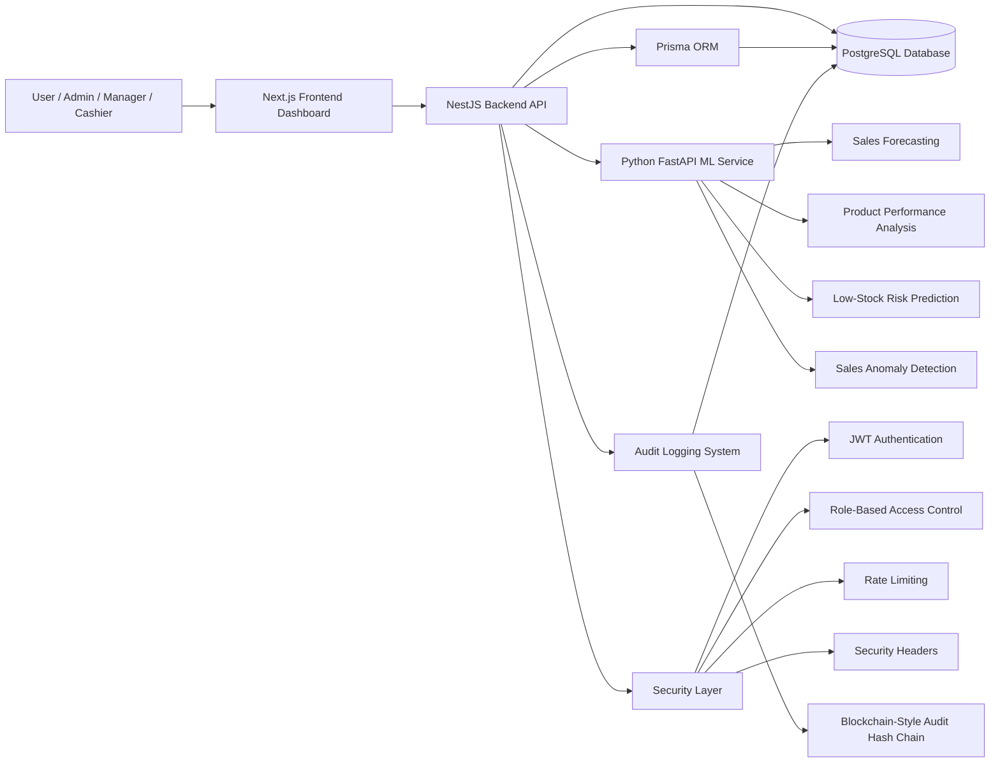
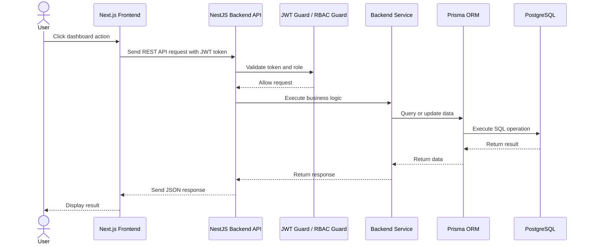
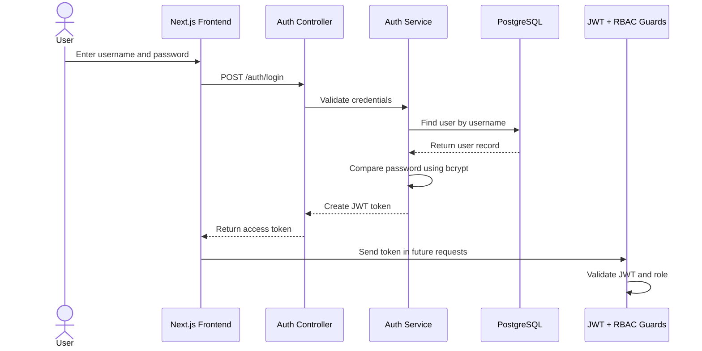
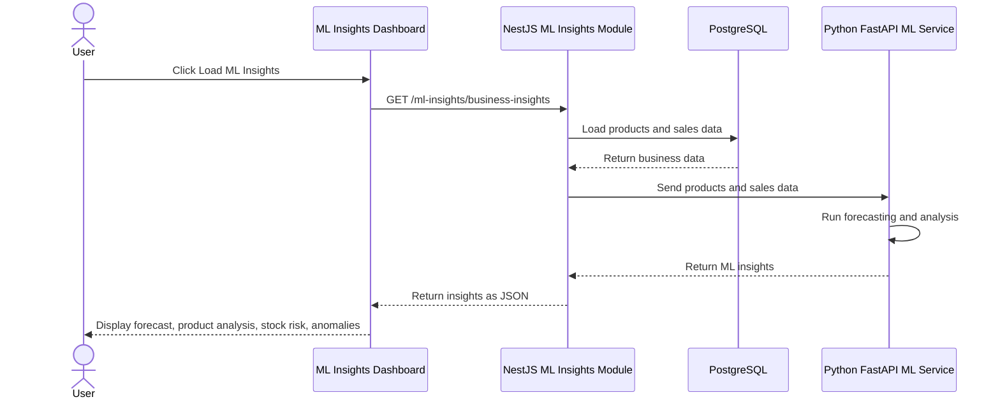
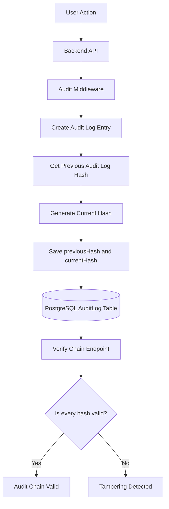
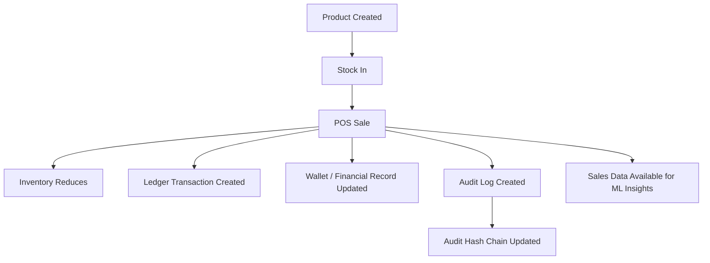
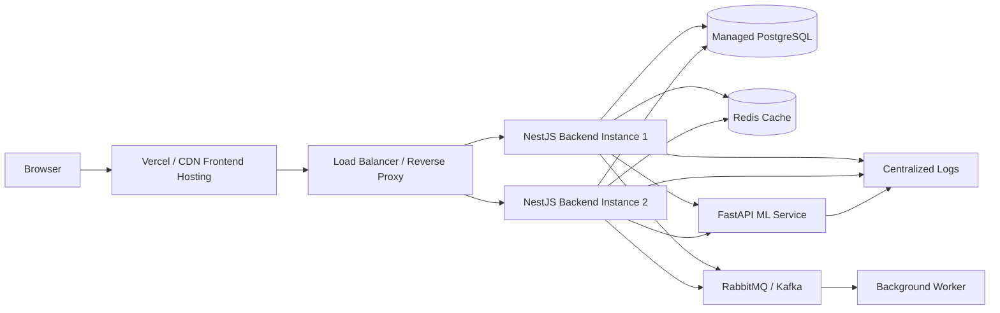

# ApexBiz System Architecture Diagrams

This document contains architecture diagrams for the ApexBiz Enterprise Platform.

These diagrams are written using Mermaid so they can be viewed directly in GitHub.

---

## 1. High-Level System Architecture

---

## 2. Frontend to Backend Request Flow

---

## 3. Authentication and Authorization Flow

---

## 4. ML Service Integration Architecture

---

## 5. Audit Hash Chain Architecture

---

## 6. Enterprise Business Flow

---

## 7. Future Production Deployment Architecture

---

## 8. Architect Interview Explanation

ApexBiz is designed as a modular enterprise system.

The frontend, backend, database, security layer, audit system, and ML service are separated by responsibility.

This architecture supports:

- maintainability
- scalability
- security
- auditability
- future cloud deployment
- future caching
- future event-driven processing
- future microservice migration
